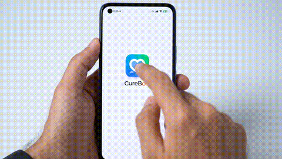

# 🩺 CureBot - AI Health Assistant

CureBot is a smart AI-based Streamlit assistant that suggests doctors based on user symptoms using Gemini (Vertex AI) and shows their availability.

---

## 📦 Features

- 🔐 Google OAuth login
- Input your symptoms and get the right specialization
- Lists available doctors from a local SQLite DB
- Provides a next appointment slot
- Upload and summarize prescriptions in multiple languages
- Upload insurance policy and get AI-generated summaries
- Uses Vertex AI's Gemini 1.5 model
- Simple and elegant UI using Streamlit

---

## 🎥 Demo

  <!-- if converted to GIF -->

## 🚀 Quickstart (Local)

### 1. Clone the repo

```bash
git clone https://gitlab.com/use-case2/curebot.git
cd curebot
````

### 2. Create and activate a virtual environment

```bash
python3 -m venv env
source env/bin/activate
```

### 3. Install dependencies

```bash
pip install -r requirements.txt
```

### 4. Set environment variables

Create a `.env` file:

```env
GCP_PROJECT_ID=your-gcp-project-id
GCP_LOCATION=us-central1
MODEL_NAME=gemini-1.5-pro

GOOGLE_CLIENT_ID=your-google-oauth-client-id
GOOGLE_CLIENT_SECRET=your-google-oauth-client-secret
```

---

## 🔑 How to Get Google OAuth Client ID and Secret

1. **Go to Google Cloud Console**
   [https://console.cloud.google.com/apis/credentials](https://console.cloud.google.com/apis/credentials)

2. **Create a New Project** (or select your existing project)

3. **Enable OAuth Consent Screen**

   * Go to `OAuth consent screen` in the sidebar
   * Choose **External** user type
   * Fill in the app info
   * Add yourself as a **Test User**

4. **Create OAuth 2.0 Credentials**

   * Go to `Credentials` > `+ Create Credentials` > **OAuth client ID**
   * Choose **Application type: Web application**
   * Give a name (e.g., `CureBot Local`)
   * Under **Authorized redirect URIs**, add:

     ```
     http://localhost:8501
     ```
   * Click **Create**

5. **Copy the Client ID and Client Secret**

   * You'll see a popup with your credentials
   * Add them to your `.env` file like this:

   ```env
   GOOGLE_CLIENT_ID=your-client-id.apps.googleusercontent.com
   GOOGLE_CLIENT_SECRET=your-client-secret
   ```


### 1. Create OAuth Credentials

* Go to [Google Cloud Console](https://console.cloud.google.com/apis/credentials)
* Create **OAuth 2.0 Client ID**

  * App type: Web application
  * Authorized redirect URI: `http://localhost:8501`

### 2. Make the App Public

If you're getting this error:

```
Error 403: org_internal — This app is restricted to users within its organization.
```

Fix it by:

* Going to **OAuth consent screen**
* Change **User Type** from `Internal` to `External`
* Add your Gmail under **Test Users**

### 3. Example `.env` for OAuth

```env
GOOGLE_CLIENT_ID=1234567890-abcxyz.apps.googleusercontent.com
GOOGLE_CLIENT_SECRET=your_secret_key
```

---

## 🧠 Vertex AI Setup

Make sure you're logged into Google Cloud and your project is set:

```bash
gcloud auth login
gcloud config set project your-gcp-project-id
```

Enable required services:

```bash
gcloud services enable aiplatform.googleapis.com
```

Ensure your account has the role:

```bash
gcloud projects add-iam-policy-binding your-gcp-project-id \
  --member="user:your-email@gmail.com" \
  --role="roles/aiplatform.user"
```

---

## 🗂️ Seed the Database

```bash
python seed_db.py
```

This will populate `curebot.db` with 20+ sample doctors.

---

## ▶️ Run Streamlit App

```bash
streamlit run main.py
```

Open your browser at [http://localhost:8501](http://localhost:8501)

---

## 🐳 Docker (optional)

### Build

```bash
docker build -t curebot .
```

### Run locally

```bash
docker run -p 8501:8501 curebot
```

---

## ☁️ Cloud Run (optional)

### Authenticate and deploy

```bash
gcloud auth login
gcloud config set project your-gcp-project-id
gcloud builds submit --tag gcr.io/your-gcp-project-id/curebot
gcloud run deploy curebot \
  --image gcr.io/your-gcp-project-id/curebot \
  --platform managed \
  --region us-central1 \
  --allow-unauthenticated
```

---

## 📝 License

MIT

---

## 🙋‍♂️ Maintainer

Sagar Bagwe – [sagarbagwe@google.com](mailto:sagarbagwe@google.com)


